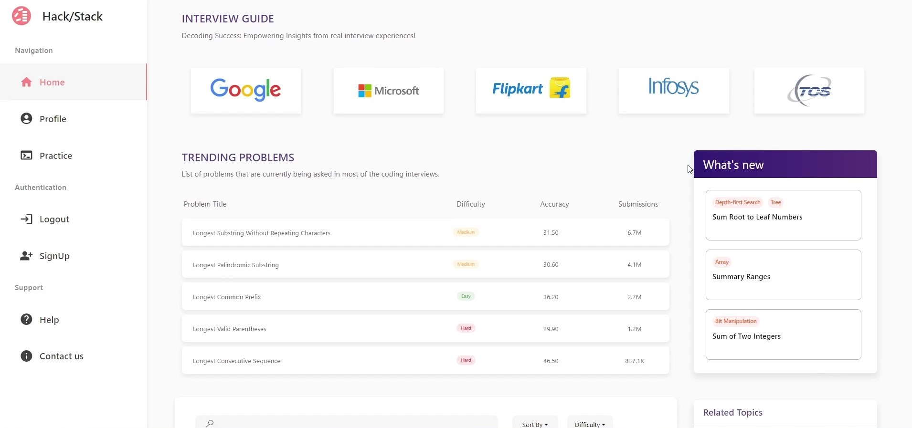

# Web-Dev-Projects

 

  
Table of Contents

  <ol>
    <li>
      <a href="#hack/stack">Hack/Stack</a>
    </li>
    <li>
      <a href="#job-posts-microservice">Job Posts Microservice</a>
    </li>
    <li>
      <a href="#social-media-posts-microservice">Social-Media-Posts Microservice</a>
    </li>
    <li>
      <a href="#book-store-website">Book Store Website</a>
    <li>
      <a href="#movies-website">Movies Website</a>
    </li>
  </ol>

 

## Hack/Stack

`Click Image -> Repo`

### About The Project

This is a `React` and `Django` Application for analyzing your coding performance using interactive plots and generating necessary recommendations.

### Built With

![Django] ![React.js] ![HTML] ![CSS] ![Bootstrap] ![scikitlearn] ![tensorflow]

 

## Job Posts Microservice

`Click Image -> Repo`

### About The Project

This is a Django project with frontend ui and a search engine at the backend.

### Built With

![spring] ![React.js] ![rabbitmq] 

 

## Social Media Posts Microservice

`Click Image -> Repo`

### About The Project

This is a Django project with frontend ui and a search engine at the backend.

### Built With

![spring] ![React.js] ![rabbitmq]

### Usage

This is a Django project with frontend ui and a search engine at the backend.

 

## Book Store Website

### About The Project

This is a Django project with frontend ui and a search engine at the backend.

### Built With

This is a Django project with frontend ui and a search engine at the backend.

### Usage

This is a Django project with frontend ui and a search engine at the backend.

 

## Movies Website

### About The Project

This is a Django project with frontend ui and a search engine at the backend.

### Built With

This is a Django project with frontend ui and a search engine at the backend.

### Usage

This is a Django project with frontend ui and a search engine at the backend.

[Django]:https://img.shields.io/badge/Django-black?style=for-the-badge&logo=django
[HTML]:https://img.shields.io/badge/HTML-grey?style=for-the-badge&logo=html5
[CSS]:https://img.shields.io/badge/CSS-blue?style=for-the-badge&logo=css3
[Bootstrap]:https://img.shields.io/badge/Bootstrap-563D7C?style=for-the-badge&logo=bootstrap&logoColor=white
[React.js]: https://img.shields.io/badge/React-20232A?style=for-the-badge&logo=react&logoColor=61DAFB
[scikitlearn]:https://img.shields.io/badge/Scikit--Learn-white?style=for-the-badge&logo=scikit-learn
[tensorflow]:https://img.shields.io/badge/Tensorflow-black?style=for-the-badge&logo=tensorflow
[spring]:https://img.shields.io/badge/Spring--Boot-249141?style=for-the-badge&logo=spring&logoColor=white
[rabbitmq]:https://img.shields.io/badge/RabbitMQ-orange?style=for-the-badge&logo=rabbitmq&logoColor=white
